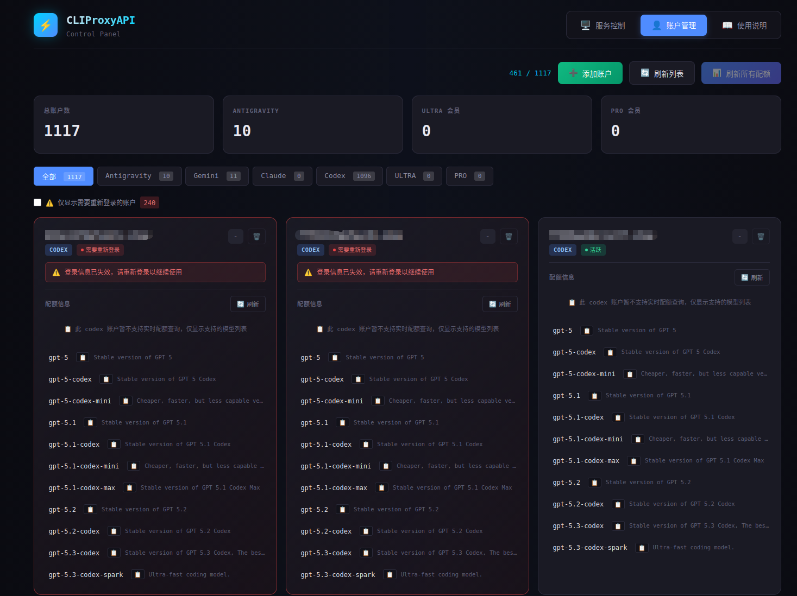
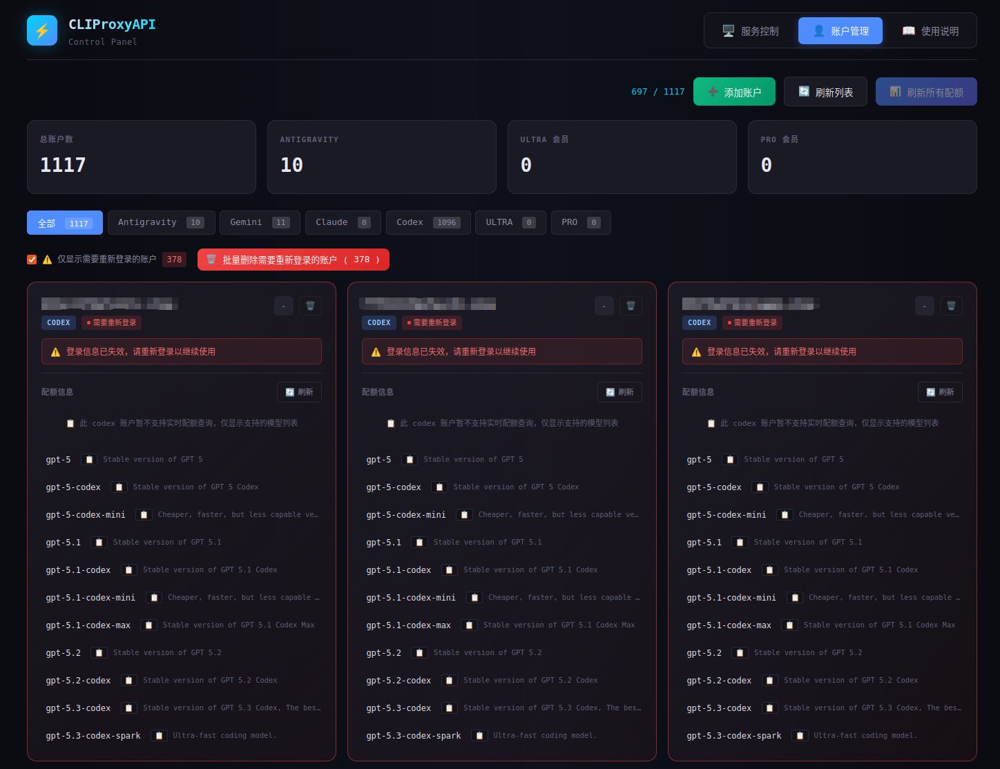
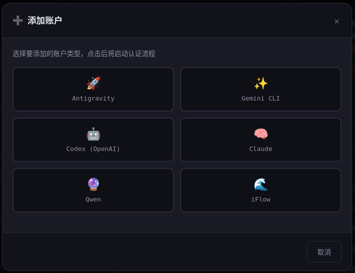
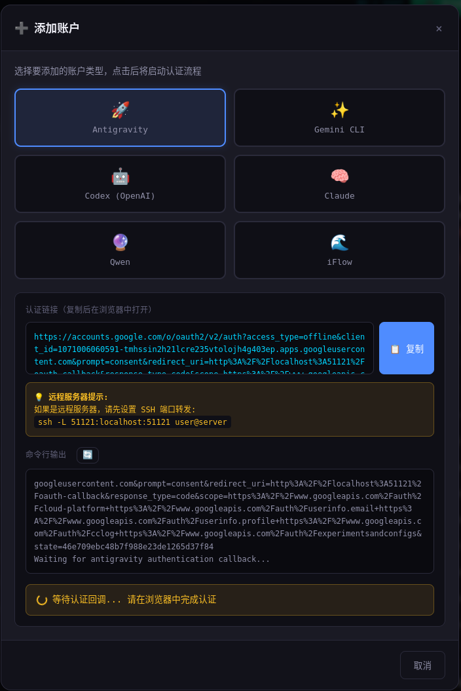

# CPA-Dashboard

CLIProxyAPI 控制面板 - 服务管理与账户监控 Web 界面。

## 功能概览

### 服务控制
- 启动 / 停止 / 重启 CLIProxyAPI 服务
- 实时查看服务运行状态（PID、运行目录等）
- 查看运行日志（支持语法高亮、自动刷新）
- 清除日志文件

### 账户管理
- 显示所有账户列表（Antigravity、Gemini、Claude、Codex、Qwen、iFlow、Kimi、AI Studio、Vertex 等）
- 显示会员等级（ULTRA/PRO/FREE）及账户状态（活跃 / 需要重新登录）
- 显示每个模型的配额百分比及重置倒计时（Antigravity 实时配额）；其他类型显示静态支持的模型列表
- 配额缓存持久化（重启后保留）
- **刷新配额**：单个账户刷新 / 批量并行刷新所有账户（并行度可配置，默认 4）；刷新时会校验账号是否仍有效
- **Codex 鉴权**：刷新 Codex 账户时除 OAuth 刷新外，会请求 Codex Models API；若返回 401 则标记为「需要重新登录」，更准确
- **筛选**：
  - **类型**：全部、Antigravity、Gemini、Claude、Codex、ULTRA、PRO
  - **状态**：可勾选「仅显示需要重新登录的账户」，与类型组合（如：Codex + 仅显示需要重新登录 → 只显示需重新登录的 Codex 账户）
- **批量删除**：勾选「仅显示需要重新登录的账户」后，显示「批量删除需要重新登录的账户」按钮，带二次确认，可一键删除当前列表中的失效账户
- **添加账户**：通过 OAuth 登录添加新账户（支持 Antigravity / Gemini / Codex / Claude / Qwen / iFlow / Kimi）
- **删除账户**：删除指定账户（带确认对话框）

## 安装

```bash
pip install -r requirements.txt
```

## 使用

### 方式一：直接运行
```bash
python app.py
```

### 方式二：通过启动脚本
```bash
# macOS / 通用
./start.sh

# Linux（优先使用 $HOME/cliproxyapi，可设置 CLIPROXYAPI_DIR 覆盖）
./start-linux.sh
```

### 方式三：Windows 10/11 原生启动
```powershell
powershell -NoProfile -ExecutionPolicy Bypass -File .\start-windows.ps1
```

仅做环境检查（不启动服务）：
```powershell
powershell -NoProfile -ExecutionPolicy Bypass -File .\start-windows.ps1 -CheckOnly
```

强制重装依赖：
```powershell
powershell -NoProfile -ExecutionPolicy Bypass -File .\start-windows.ps1 -ReinstallDeps
```

说明：
- 该脚本会自动创建 `venv`、安装依赖并启动 `app.py`。
- 支持 Windows 10/11 原生运行（不依赖 WSL）。
- 会自动探测 CLIProxyAPI 配置目录，优先级为：`CLIPROXYAPI_DIR` → `%USERPROFILE%\\cliproxyapi` → `..\\CLIProxyAPI`。
- 如已手动设置 `CPA_CONFIG_PATH`，则优先使用你设置的路径。
- 启动后默认访问 `http://127.0.0.1:5000`。
- 启动日志文件：`start-windows-last.log`。

默认访问 http://127.0.0.1:5000

## 配置

程序会自动从环境变量或父目录查找 `config.yaml` 读取配置：
- `port` - CLIProxyAPI 端口
- `auth-dir` - 认证文件目录
- `quota-refresh-concurrency` - 批量刷新配额时的并发数（见下方说明）

### 如何配置批量刷新并发数

点击「刷新所有配额」时，同时请求的账户数量由**并发数**控制（默认 4）。可按需调大以加快刷新，或调小以减轻对上游 API 的压力。

**方式一：环境变量（推荐）**

在启动 Dashboard 前设置：

```bash
# Linux / macOS
export CPA_QUOTA_REFRESH_CONCURRENCY=8
python app.py

# 或使用启动脚本时
CPA_QUOTA_REFRESH_CONCURRENCY=8 ./start.sh
```

**方式二：config.yaml**

在 CLIProxyAPI 使用的 `config.yaml` 中增加（与 `port`、`auth-dir` 等同级）：

```yaml
quota-refresh-concurrency: 8
```

- 有效范围：**1–32**，超出会自动限制在此区间。
- 修改后需**重启 Dashboard**（若用 config.yaml）或**刷新浏览器并重新进入账户页**，新的并发数才会生效。

### 环境变量一览

| 变量 | 说明 | 默认值 |
|------|------|--------|
| `CPA_CONFIG_PATH` | config.yaml 绝对路径 | 自动查找 |
| `CPA_AUTH_DIR` | 认证文件目录（覆盖 config 的 auth-dir） | 从 config 读取 |
| `CPA_SERVICE_DIR` | CLIProxyAPI 服务目录 | 从 config 路径推导 |
| `CPA_BINARY_NAME` | 可执行文件名 | `CLIProxyAPI` |
| `CPA_LOG_FILE` | 日志文件路径 | `cliproxyapi.log` |
| `CPA_MANAGEMENT_URL` | Management API 地址 | `http://127.0.0.1:{port}` |
| `CPA_MANAGEMENT_KEY` | Management API 密钥 | - |
| `WEBUI_HOST` | WebUI 监听地址 | `127.0.0.1` |
| `WEBUI_PORT` | WebUI 端口 | `5000` |
| `CPA_QUOTA_REFRESH_CONCURRENCY` | 批量刷新配额并发数 | `4`（范围 1–32） |
| `CPA_ANTIGRAVITY_CLIENT_ID` | Antigravity OAuth Client ID（用于配额刷新） | 未设置则 Antigravity 配额刷新不可用 |
| `CPA_ANTIGRAVITY_CLIENT_SECRET` | Antigravity OAuth Client Secret | 同上 |

## 运行模式

1. **本地模式**（默认）：直接读取 auth 目录中的 JSON 文件
2. **API 模式**：设置 `CPA_MANAGEMENT_KEY` 后通过 Management API 获取数据

## 界面说明

### 基本界面



顶部导航：**服务控制**、**账户管理**、**使用说明**。账户管理页包含统计概览、类型/状态筛选、账户卡片与操作按钮。

### 服务控制


- **服务状态**：实时显示 CLIProxyAPI 运行状态（绿色=运行，红色=停止），含 PID、服务目录、日志路径
- **服务控制**：🟢 启动 / 🟠 停止 / 🔵 重启
- **运行日志**：自动刷新开关、手动刷新、跳转底部、清除日志

### 账户管理


- **统计概览**：总账户数、Antigravity 数、ULTRA/PRO 会员数
- **类型筛选**：全部、Antigravity、Gemini、Claude、Codex、ULTRA、PRO
- **状态筛选**：勾选「⚠️ 仅显示需要重新登录的账户」可与类型组合；勾选后显示「批量删除需要重新登录的账户 (N)」按钮
- **账户卡片**：邮箱、类型标签、会员等级、状态（活跃 / 需要重新登录）、配额信息（或静态模型列表）、刷新 / 删除按钮

### 刷新配额与鉴别需要重新登录



- 点击「刷新所有配额」会批量刷新并校验各账号 token；Codex 会额外请求 Models API，401 则标记为需要重新登录
- 勾选「仅显示需要重新登录的账户」可查看并批量删除失效账号（带二次确认）

### 添加账户（OAuth 登录）



选择 Provider（共 7 个：Antigravity、Gemini CLI、Codex、Claude、Qwen、iFlow、Kimi）后启动 OAuth。认证链接会出现在「认证链接」框或命令行输出中，复制到浏览器打开即可；Qwen、Kimi 为设备码流程，链接会自动填入上方认证链接框。部分流程需在终端按提示输入（如项目 ID、回调 URL 等）。



认证成功后账户会出现在列表中，可在此处刷新配额或删除。

### 添加账户支持的 Provider

| Provider | 说明 | 回调端口 |
|----------|------|----------|
| Antigravity | Google Antigravity 账户 | 51121 |
| Gemini CLI | Google Gemini CLI 账户 | 8085 |
| Codex | OpenAI Codex 账户 | 1455 |
| Claude | Anthropic Claude 账户 | 54545 |
| Qwen | 通义千问账户 | 设备码模式 |
| iFlow | iFlow 账户 | 55998 |
| Kimi | Moonshot Kimi 账户 | 设备码模式 |

**远程服务器**：需 SSH 端口转发后再在本地浏览器完成 OAuth，例如：

```bash
ssh -L 51121:localhost:51121 user@server
```

### 使用说明（API 示例）


- **连接信息**：Base URL、API Key、可用 Keys 数量
- **所有 API Keys**：列表与复制
- **示例**：cURL、Python requests、OpenAI SDK、流式请求等，可直接复制使用

## 注意

- **配额**：仅 Antigravity 支持实时配额（模型别名与 CLIProxyAPI 一致）；其余类型（Gemini/Codex/Claude/Qwen/iFlow/Kimi/AI Studio/Vertex）显示静态模型列表，与 CLIProxyAPI `internal/registry/model_definitions_static_data.go` 同步

### Linux 常见问题

- **只显示部分账户**：检查认证目录是否正确。若 config 中 `auth-dir` 为相对路径（如 `auths`），会相对于 config 所在目录解析。可设置 `CPA_AUTH_DIR` 显式指定，例如：`export CPA_AUTH_DIR="$HOME/.cli-proxy-api"`
- **配额刷新无显示**：若 `start-linux.sh` 中设置了代理，配额 API 请求会绕过代理（使用直连）。若仍失败，可检查网络或临时取消代理后重试
- **服务控制**：需正确配置 `CPA_SERVICE_DIR`（或通过 `start-linux.sh` / 环境变量指定）
